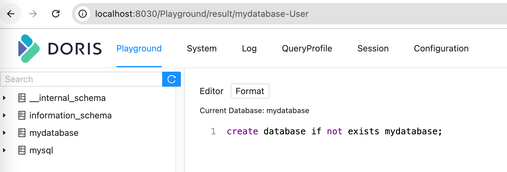

# resinkit-terra


### Components
- flink:1.19.1-scala_2.12-java17
- Paimon
- Flink-CDC
- Kafka

### Ports
- 8081 // Flink web UI
- 8083 // Flink SQL gateway
- 6123 // JobManager's RPC 
- 6121-6130 // TaskManagers' data


## Quick Start

### Single docker container

```shell
# build just the docker
make jar resinkit-terra

# some quick test to make sure the container works
make resinkit-terra-test
```

## Integration tests

### Test case: MySQL to Doris

1. `make resinkit-terra-build-mysql2doris`
2. Wait until doris is up, and then: 
   1. using doris FE web portal to execute: `create database mydatabase;`
      1. Navigate to http://localhost:8030/Playground/ 
      2. login with `root` and empty password
      3. run `create database mydatabase;`. 
   2. using CLI:
      ```shell
      docker exec -it resinkit-terra-mysql2doris-doris-1 mysql -h 127.0.0.1 -uroot -P9030 -e 'create database if not exists mydatabase;'
      ```
3. `make resinkit-terra-test-mysql2doris`
4. View Events on Flink
   1. http://localhost:8081/#/job-manager/logs
   2. http://localhost:8081/#/task-manager


### Test case: MySQL to Kafka

1. Repeat the step 1 & 2 from above.
2. Run the tests: `resinkit-terra-test-mysql2kafka`


